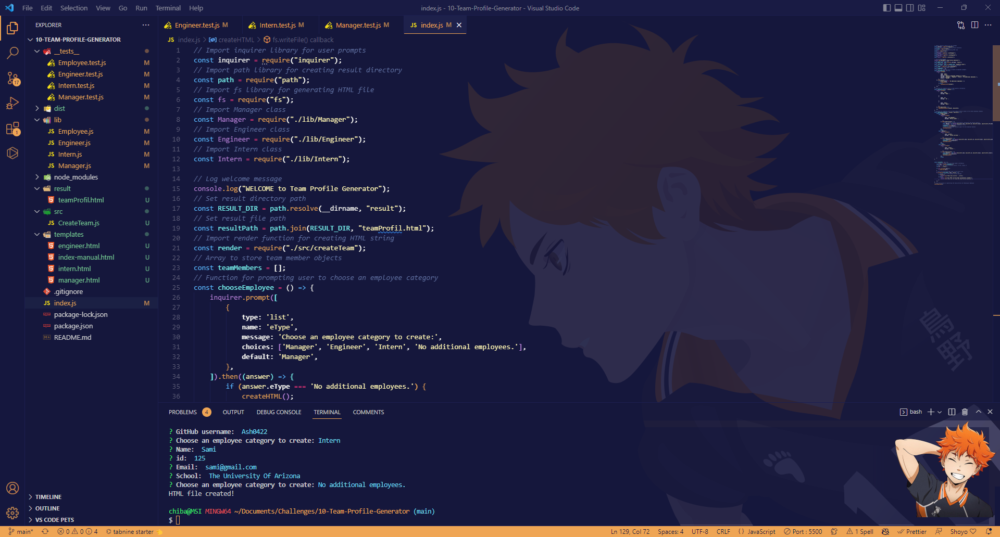
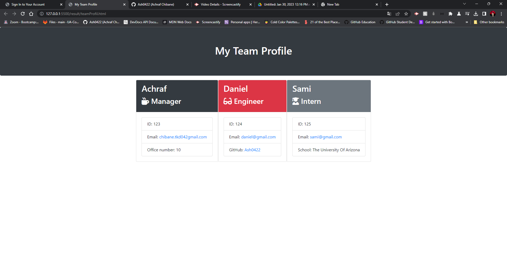

# 10-Team-Profile-Generator

[](https://badge.fury.io/gh/yourusername%2Fyourrepo)
[](https://travis-ci.org/yourusername/yourrepo)
[](https://coveralls.io/github/Ash0422/09_README_Generator?branch=master)

## Table of Contents
- [Description](#description)
- [Screenshots](#screenshots)
- [Installation](#installation)
- [Usage](#usage)
- [The directory structure](#The-directory-structure)
- [User Story](#User-Story)
- [Acceptance Criteria](#Acceptance-Criteria)
- [License](#license)
- [Contributing](#contributing)
- [Tests](#tests)
- [Questions](#questions)

## Description
```
Your challenge is to build a Node.js command-line application that takes in information about employees on a software engineering team and generates an HTML webpage that displays summaries for each person.
```
## Screenshots




## Installation
The application will be invoked by using the following command: node index.js

## Usage

IT build a Node.js command-line application that takes in information about employees on a software engineering team and generates an HTML webpage that displays summaries for each person.

You can also watch a video demonstration of the application [here](https://watch.screencastify.com/v/qPbDTFGqt8aIQiJB3or7).

## The directory structure
```
├── __tests__/             //jest tests
│   ├── Employee.test.js
│   ├── Engineer.test.js
│   ├── Intern.test.js
│   └── Manager.test.js
├── dist/                  // rendered output (HTML) and CSS style sheet      
├── lib/                   // classes
├── src/                   // template helper code 
├── .gitignore             // indicates which folders and files Git should ignore
├── index.js               // runs the application
└── package.json   
```
## User Story
```
AS A manager
I WANT to generate a webpage that displays my team's basic info
SO THAT I have quick access to their emails and GitHub profiles
```
## Acceptance Criteria
```
GIVEN a command-line application that accepts user input
WHEN I am prompted for my team members and their information
THEN an HTML file is generated that displays a nicely formatted team roster based on user input
WHEN I click on an email address in the HTML
THEN my default email program opens and populates the TO field of the email with the address
WHEN I click on the GitHub username
THEN that GitHub profile opens in a new tab
WHEN I start the application
THEN I am prompted to enter the team manager’s name, employee ID, email address, and office number
WHEN I enter the team manager’s name, employee ID, email address, and office number
THEN I am presented with a menu with the option to add an engineer or an intern or to finish building my team
WHEN I select the engineer option
THEN I am prompted to enter the engineer’s name, ID, email, and GitHub username, and I am taken back to the menu
WHEN I select the intern option
THEN I am prompted to enter the intern’s name, ID, email, and school, and I am taken back to the menu
WHEN I decide to finish building my team
THEN I exit the application, and the HTML is generated
```
## License
This project is licensed under the MIT license.

## Contributing
Pull requests are welcome, please open an issue first to discuss what you would like to change. thank you

## Tests
This application has been tested by the creator and it works fine.

## Questions
For any additional questions, please contact me at chibane.tkd04@gmail.com or visit my GitHub profile at https://github.com/Ash0422.

